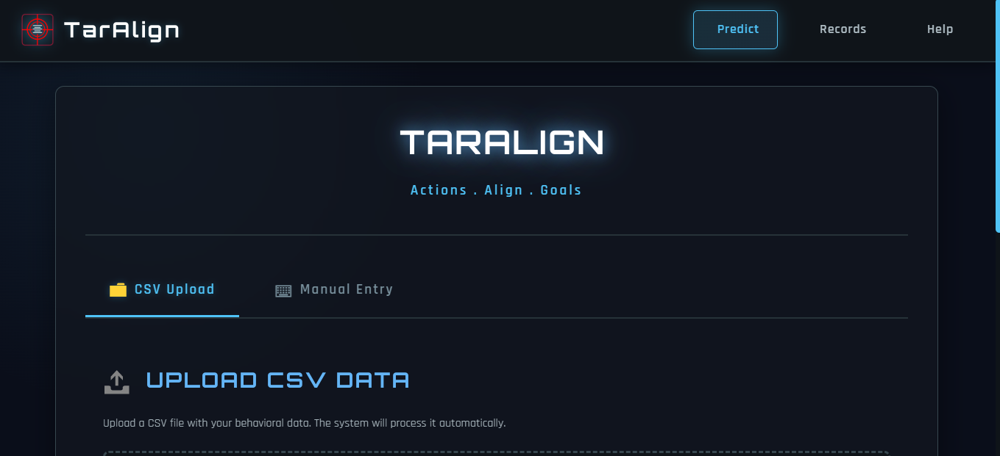
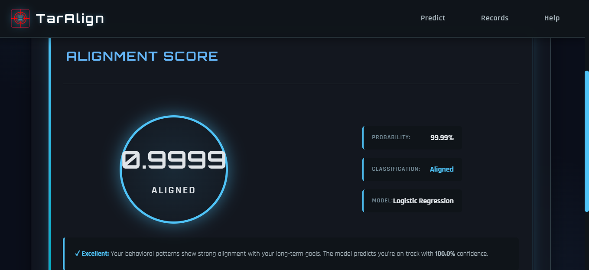
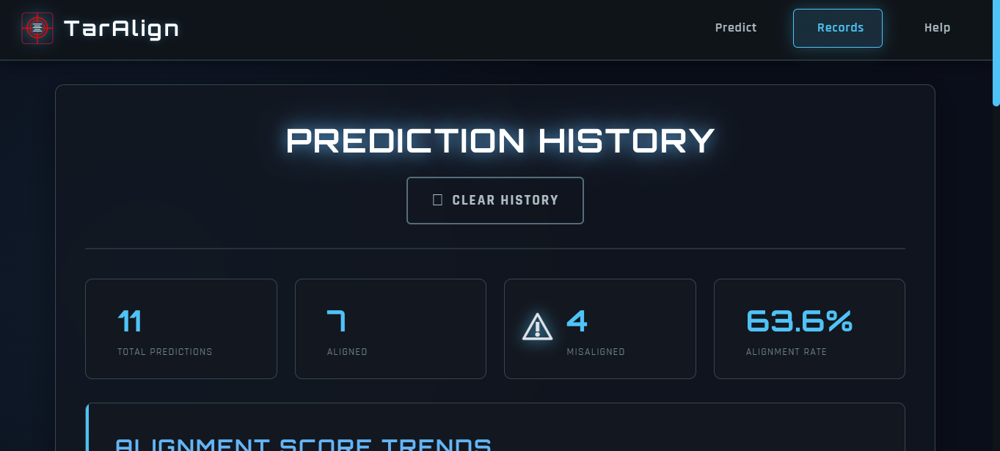
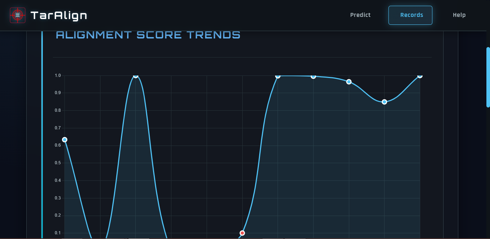

  

# 🚀 TarAlign – Behaviour–Goal Alignment Predictor

**Is your behaviour truly capable of achieving your targets?**  
Most people set big goals — but daily actions silently determine whether we reach them.

Introducing **TarAlign**, an AI-powered behavioural analysis system that predicts how well your daily habits align with your long-term goals.

---

---

## 📸 UI Preview

<table>
  <tr>
    <td align="center">
      <strong>Predict Page</strong> 
      
    </td>
    <td align="center">
      <strong>Result Page</strong> 
      
    </td>
  </tr>
  <tr>
    <td align="center">
      <strong>Track & Trends</strong> 
      
    </td>
    <td align="center">
      <strong>Help Page</strong> 
      
    </td>
  </tr>
</table>

---

## ✨ What is TarAlign?

TarAlign is a machine-learning-based web application that analyzes **20 core behavioural features** — including sleep, consistency, task switching, friction, momentum, and daily effort — to generate a clear **Alignment Score**:

- 🔵 **Aligned**  
- 🔴 **Misaligned**  

Along with a probability measure (0–1 scale) to show how strongly your behaviour supports your goals.

It uses:
- Python  
- Flask  
- Logistic Regression  
- A balanced 5400-row custom behavioural dataset  
- A modern glowing UI  
- Charts for historical insights  

---

## 🧠 Quick Example

Imagine you want to become better at coding.  
You code for **2 hours every day for a month**, maintain good consistency, sleep well, and keep low friction.  
TarAlign will detect the strong pattern → **Aligned**.

But if consistency drops, sleep falls, or friction rises, even the same 2 hours/day can shift the prediction → **Misaligned**.

---

## 🎯 Features

### ✔ Behaviour–Goal Alignment Score  
Outputs:
- Alignment score (0–1)  
- Class: Aligned / Misaligned  
- Probability & confidence  

### ✔ 20 Behavioural Inputs  
Covers:
- Daily effort  
- Weekly averages  
- Monthly momentum  
- Task switching  
- Sleep patterns  
- Goal weights (career / fitness / learning)  

### ✔ CSV Upload + Manual Entry  
Choose:
- Upload your behavioural CSV  
- Or answer 20 simple questions manually  

### ✔ Prediction History Dashboard  
- Stores all predictions  
- Timestamped  
- Aligned vs misaligned count  
- Trendline chart  
- Searchable prediction table  

### ✔ Clean UI Design  
- Animated glowing buttons  
- Tabs (Upload / Manual)  
- Responsive layout  
- Dark-theme aesthetics  

---

## 📁 Project Structure

TarAlign/
│
├── flask_app.py # Flask web app
├── src/ # Training, evaluation & dataset generation
│ ├── pipeline.py
│ ├── data_loader.py
│ ├── feature_engineering.py
│ ├── train_models.py
│ ├── evaluate.py
│ └── explainability.py
│
├── models/ # Trained model (included for easy running)
│ ├── logisticregression_model.joblib
│ └── features.json
│
├── templates/ # HTML UI pages
├── static/ # CSS / JS / Images
├── datasets/ # Custom dataset (20-feature 5400 rows)
├── download_template/ # CSV template generator
└── README.md # Documentation

📊 Model Performance

Using the custom 5400-row balanced dataset (20 features):

Accuracy: 0.8315

Recall: 0.8333

Precision: 0.8333

F1-Score: 0.8333

ROC-AUC: 0.9174

Excellent performance for a behavioural prediction model.

📦 Technologies Used

Python

Flask

Logistic Regression

Pandas / NumPy

Chart.js

Jinja2 Templates

HTML / CSS / JavaScript

🤝 Contributing

Contributions, feature ideas, and UI improvements are welcome!
Feel free to open issues or submit pull requests.

📜 License

This project is open-source under the MIT License.

⭐ Final Note

TarAlign helps people see the true relationship between their daily habits and their long-term goals — making self-improvement more measurable, predictable, and real.
